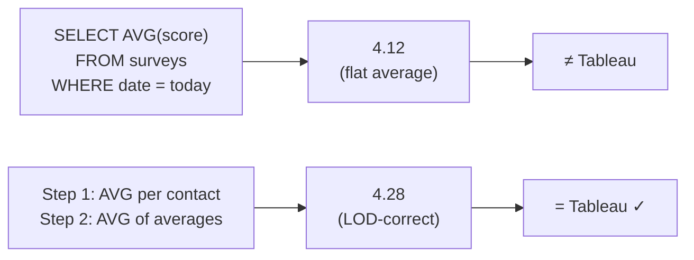
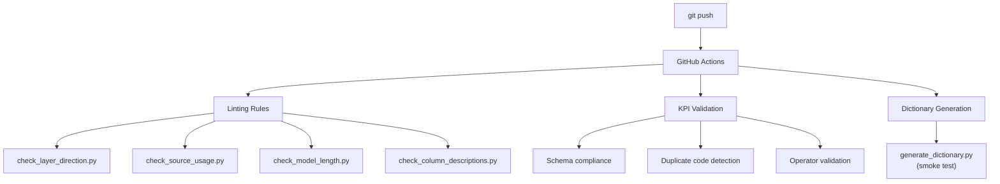

# metric-framework — Architecture

---

## Project Structure

```
metric-framework/
├── tests/                      # dbt test macros
│   ├── test_has_yesterdays_data.sql    # Freshness check
│   ├── test_distribution_drift.sql    # Distribution shift detection
│   ├── test_anomaly_zscore.sql        # Z-score anomaly flagging
│   └── test_metric_accuracy.sql       # Tolerance-band validation
├── kpi_definitions/            # YAML-based KPI governance
│   ├── kpi_schema.yml          # Schema definition
│   └── examples/
│       ├── ces.yml             # Customer Effort Score
│       └── aht.yml             # Average Handle Time
├── linting/                    # CI/CD enforcement rules
│   ├── check_layer_direction.py       # No backwards refs
│   ├── check_source_usage.py          # Marts use ref() only
│   ├── check_model_length.py          # Complexity limit
│   └── check_column_descriptions.py   # Documentation coverage
├── scripts/                    # Utilities
│   ├── generate_dictionary.py  # YAML → Markdown dictionary
│   ├── validate_kpis.py        # Schema validation + tolerance bands
│   └── metrics_log.py          # JSONL tracking + recurring failure detection
└── .github/workflows/ci.yml    # GitHub Actions pipeline
```

---

## Design Principles

| Principle | Implementation |
|-----------|---------------|
| Declarative KPI governance | YAML schema defines formulas, LOD patterns, gotchas |
| Two-step LOD enforcement | Schema requires `first_level` + `second_level` aggregation |
| Shift-left quality | Linting rules catch issues before CI, not after |
| Tolerance-band validation | Different thresholds per metric type (±2pp for %, ±5% for counts) |
| Cross-run meta-analysis | JSONL log tracks failures over time, detects systemic issues |

---

## The LOD Problem (Why This Exists)



Most KPI mismatches between SQL and BI tools come from aggregation order. This framework enforces documenting both levels in the KPI schema, making the correct pattern discoverable.

---

## CI/CD Pipeline



---

## Data Quality Test Macros

| Test | Detection Method | Threshold |
|------|-----------------|-----------|
| `has_yesterdays_data` | MAX(date) < yesterday | Binary (pass/fail) |
| `distribution_drift` | Current mean vs 30-day baseline | > 2σ deviation |
| `anomaly_zscore` | Z-score against rolling window | > 3.0 |
| `metric_accuracy` | Computed vs expected value | Configurable tolerance |
